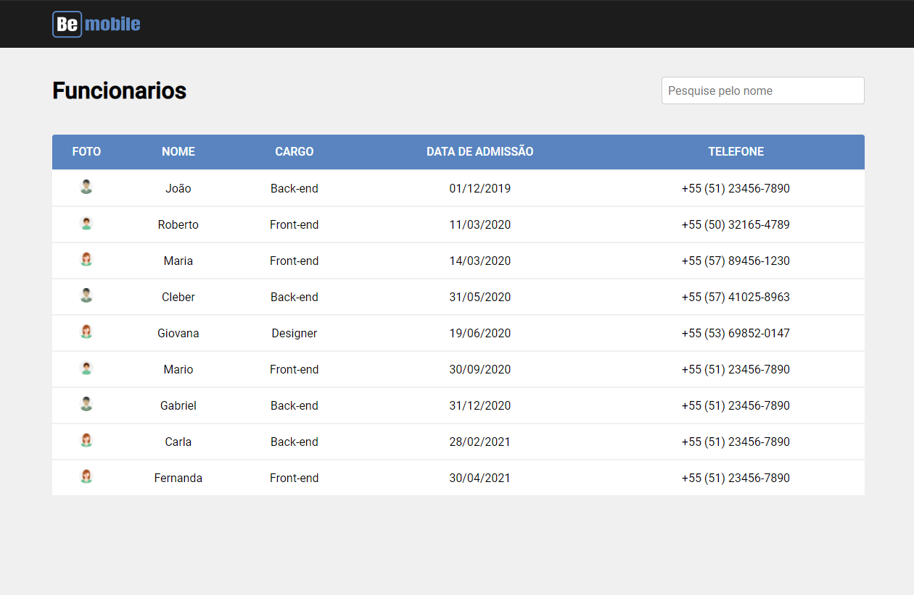

# Sobre
Desafio realizado para vaga de dev front-end react

# Como exercutar

1 - rode o comando git clone https://github.com/well-silva/table-users.git  
2 - cd table-users  
3 - yarn 
4 - code . 
6 - rode o comando yarn json-server --watch server.json para iniciar o json-server 
7 - no terminal rode yarn start 
